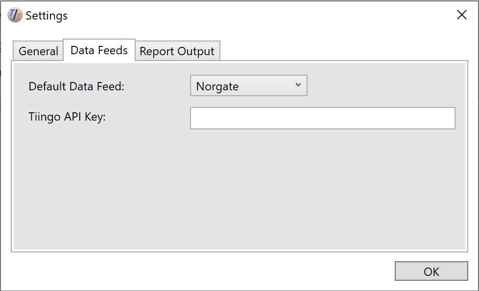

# Data Setup

To run simulations of stock and options algorithms, TuringTrader requires market data, most notably quotations and trade volumes. This section describes how to set up your data for use with TuringTrader. 

## Nomenclature

When it comes to data, TuringTrader distinguishes between the following entities: 

- Data Feed: a data feed is a service or protocol, through which a data source receives its data. Examples of data feeds are .csv files, Tiingo, FRED, or Norgate Data.
- Database: the database is the collection of all data available to TuringTrader. In the default installation, it resides in your Documents/TuringTrader/Data folder and contains a large number of files in various formats.
- Ticker: the ticker is the sequence of typically 3 to 5 characters used to identify an instrument within a given exchange. The ticker needs to be unique within each algorithm, for us to distinguish the instruments. Examples for tickers are 'AAPL,' or 'XSP.' 
- Symbol: most of the time, the symbol is identical to the ticker. When it comes to options though, the symbol also includes the expiry date, the option right, and the strike price. An example of an options symbol is 'XSP180919C00289000'.
- [Instrument](xref:TuringTrader.Simulator.Instrument): Instruments are containers holding everything we know about a share or contract traded on the market. Part of these data, like the ticker, the full name, or an option's expiry date, are static. Other information, like the open/ high/ low/ close quotes, are time series data.
- [DataSource](xref:TuringTrader.Simulator.DataSource): TuringTrader instruments receive data from the database or a data feed through one or more data source instances. Each data source provides data to one or more instruments. Typically, we have little reason to interact with data sources directly while developing algorithms.
- [DataUpdater](xref:TuringTrader.Simulator.DataUpdater): DataUpdaters are used to update existing .csv data. These are mostly available for historical reasons, and moving forward, we are avoiding these in favor of DataSources.
- Nickname: we distinguish data sources by their nickname. Therefore, the nickname must be unique across the database we are using. Most of the time, we use an instrument's ticker symbol as its nickname, but "My Favorite Instrument" would also be a valid nickname.
- Data Source Descriptor: DataSources have many properties, including the data feed they their data load from, the instrument's full name, and symbol mappings. Most often, TuringTrader creates data source descriptors implicitly and on the fly so that developers don't need to think about them. However, there are also situations in which we need to provide data source descriptors manually. These descriptors are .inf files with a filename matching the DataSource's nickname.

## How Algorithms Interact with Data

It is crucial to understand how algorithms interact with data, and the various entities involved. 

- During its initialization phase, an algorithm uses [AddDataSource](xref:TuringTrader.Simulator.SimulatorCore#TuringTrader_Simulator_SimulatorCore_AddDataSource_System_String_) to make one or more data sources available. AddDataSource takes a nickname as a parameter.
- TuringTrader now attempts to load a data source descriptor file, based on the nickname passed into AddDataSource. If TuringTrader can't find a matching .inf, it creates the data source descriptor implicitly, and populate it with default values.
- With the data source descriptor in hand, TuringTrader instantiates the appropriate DataSources.
- Upon simulation start, TuringTrader loops through all instantiated data sources, and requests to load the data for the simulation range. These data are cached so that multiple algorithm instances can access these data faster.
- During the simulation, TuringTrader determines the next simulation timestamp as the minimum across all data sources. TuringTrader then consumes [Bar](xref:TuringTrader.Simulator.Bar) data from the DataSources while the Bars are matching the simulation time stamp, and adds these Bars to the Instruments by matching the symbols. If no Instrument with a specific symbol exists, TuringTrader creates a new Instrument. If an Instrument becomes stale and does not receive new bars for several time stamps, TuringTrader delists it.
- Once TuringTrader has consumed all bars with a given timestamp, it passes control to the [Algorithm](xref:TuringTrader.Simulator.Algorithm). The Algorithm can now look up the available Instruments, typically based on the nickname used during initialization. The Algorithm can now interact with the Instruments by performing calculations based on the Instrument's data, or by trading shares of that instrument.

## Data Source Descriptor Format

Data Sources Descriptors are .inf files with zero or more lines. On each line, one [DataSourceParam](xref:TuringTrader.Simulator.DataSourceParam) is assigned a value.

### General Information

The following parameters provide general information about a data source:

- name: the full human-readable name for an instrument. E.g. 'Microsoft Corporation'.
- ticker: the exchange's ticker symbol, typically 3 to 5 characters long. E.g. 'MSFT'. Note that an Instrument's Symbol is created automatically and cannot be assigned.

### Time of Day

TuringTrader internally uses time stamps with date and time. When using data sources with daily data, we might need to enforce a specific time of day, typically the end of the trading session.

- time: set the simulation time of day

### Symbol Mapping

Often symbols differ, depending on the data feed or broker used. TuringTrader allows to map symbols to rectify this issue:

- `symbolIqfeed`: IQFeed/ DTN
- `symbolYahoo`: Yahoo! Finance
- `symbolInteractiveBrokers`: Interactive Brokers
- `symbolNorgate`: Norgate Data
- `symbolFred`: FRED
- `symbolTiingo`: Tiingo

### Data Feed

Typically, we want to select the data feed using TuringTrader's default data feed, as specified in TuringTrader's settings:



However, some data are only available using specific data feeds; this is especially true for the economic data provided by FRED. Under these circumstances, we need to set the data feed manually:

- `dataFeed`: can be set to CSV, FRED, Tiingo, Yahoo, InteractiveBrokers, or IQFeed.

### Data Updater

If .csv data need to be updated, we use DataUpdaters to do so:

- `dataUpdater`: select a data updater mechanism; can be Yahoo, InteractiveBrokers, or IQFeed.

As mentioned above, we'd like to discourage the use of data updaters, if your application allows to do use Data Sources instead.

## Connecting to Data Feeds

### Yahoo Finance (free)

By default, TuringTrader uses data from Yahoo Finance. The advantage of doing so is that no accounts or additional settings are required. However, there are also some significant disadvantages, which is why you should try to move away from them as soon as possible:

- the implementation is a bit of a hack. Please be prepared for this data feed to cease functioning at any time
- Yahoo seems to actively taint their data: Be prepared to find missing quotes or values set to zero.

### Tiingo (free and paid)

Tiingo is a big step up from Yahoo. Tiingo provides quite generous limits for their free accounts, which should be enough to get you started with algorithmic trading. If at some point you need more data, you can upgrade to a paid account. This makes Tiingo an excellent choice for getting started with TuringTrader.

To use Tiingo, you first need to sign-up for a free account with them. Once you have signed up, go to https://api.tiingo.com/documentation/end-of-day. Click on `Click here to see your API Token`, and copy the token. 


Next, open the Settings dialog via the `Edit/ Settings` menu. On the `Data Feeds` tab, select `Tiingo` as your default Data Feed, and copy the API key into the field below.


### FRED (free)

FRED is a fantastic source of economic data. To find the data series of interest, we recommend searching https://fred.stlouisfed.org/. Then, use the last part of the series URL as the ticker symbol. Example: The Civilian Unemployment Rate can be found at https://fred.stlouisfed.org/series/UNRATE. You can load this data series into TuringTrader using `FRED:UNRATE` as the nickname.

The FRED data series often come with weekly, monthly, or quarterly sampling frequencies. TuringTrader internally upsamples these values to match the trading days for $SPX, the S&P 500 Index. That way, we can use the FRED data series side by side with end-of-day data.

### Norgate Data (paid)

Norgate Data comes as a paid subscription. What makes them unique is how their tools mirror a fully adjusted database to your computer, so that applications can access it without accessing the network.

To set things up, first, register for a free trial at https://norgatedata.com/freetrial.php. Then install the Norgate Data Updater from https://norgatedata.com/ndu-installation.php. Next, launch the Norgate Data Updater and click `Check for Updates`. Doing so initializes your computer with initial snapshot of the Norgate database. 


Downloading the initial snapshot takes a while. Once this is completed, go to TuringTrader's Settings dialog by opening the `Edit/ Settings` menu. Make sure to choose `Norgate` as the Default Data Feed.


### IQFeed/ DTN (paid)

IQFeed is a highly reliable data feed. Unfortunately, they don't adjust their data for ordinary cash dividends, leading to issues when calculating indicators across ex-dividend days.

We will be revisiting this topic at some point. Stay tuned.

### CSV Files

TuringTrader includes a highly customizable .csv file reader, able to map virtually any .csv file. TuringTrader can read data from a single .csv file, from a folder containing many .csv files, and .csv files compressed as .zip. The following parameters can be mapped:

- `dataPath`: the path to the .csv file(s), relative to the data source descriptor
- `date`: the bar's date
- `time`: the bar's time of day
- `open`, `high`, `low`, `close`, `volume`: the open/ high/ low/ close prices, and volume
- `bid`, `ask`, `bidSize`, `askSize`: the bid/ ask prices and their respective volumes
- `optionExpiration`, `optionStrike`, `optionRight`, `optionUnderlying`: option contract specifics

#### Mapping OHLCV Data

Most often, we will encounter .csv files similar to this one:

```csv
Date,Open,High,Low,Close,TotalVolume
1/9/2006,9.63,10.05,9.62,9.97,9058500
1/10/2006,9.97,9.98,9.73,9.83,4243500
```

To parse this file, we need the following Date Source Descriptor:

```inf
name=POTASH CORP OF SASKATCHEWAN
ticker=POT
dataPath=Data\POT.X
date={1:MM/dd/yyyy}
time=16:00
open={2:F2}
high={3:F2}
low={4:F2}
close={5:F2}
volume={6}
```

Some brief notes:

- as .csv does not provide any metadata, we need to set the name and ticker manually
- we need to specify the location of the data. In this case, we point to a directory, which may contain one or more .csv files
- we pull the date from the first column in the .csv file, which is index 1. We are aware that this is different from C#'s standard convention, but the loader makes the nickname available in the field with index 0.
- we force the time of day to 4 pm, as the .csv file does not contain a time
- we load open/ close/ high/ low/ volume from the following columns

#### Mapping Options Data

Options data as purchased from the CBOE data shop are a little more complex. A typical file might look like this:

```csv
underlying_symbol,quote_date,root,expiration,strike,option_type,open,high,low,close,trade_volume,bid_size_1545,bid_1545,ask_size_1545,ask_1545,underlying_bid_1545,underlying_ask_1545,bid_size_eod,bid_eod,ask_size_eod,ask_eod,underlying_bid_eod,underlying_ask_eod,vwap,open_interest,delivery_code
^XSP,2006-08-01,JGA,2006-08-19,125.000,c,0.00,0.00,0.00,0.00,0,1579,2.15,1573,2.40,127.10,127.10,1579,2.15,1554,2.40,127.10,127.10,0.00,0,0
^XSP,2006-08-01,JGA,2006-08-19,125.000,p,0.25,0.25,0.25,0.25,10,1642,0.10,64,0.20,127.10,127.10,1642,0.10,64,0.20,127.10,127.10,0.25,1015,0
```

Parsing these files is analogous to the previous example:

```inf
name=S&P 500 MINI SPX OPTIONS INDEX
dataPath=Data\$XSP.Options
ticker=XSP
date={2:MM/dd/yyyy}
time=16:00
bidSize={12}
bid={13:F2}
askSize={14}
ask={15:F2}
optionExpiration={4:MM/dd/yyyy}
optionStrike={5:F2}
optionRight={6}
optionUnderlying=$XSP
```

Again some brief notes:

- we only specify the ticker. The simulator creates the contract symbol for us, based on the expiry, strike price and option right
- for options, we should use the bid/ ask prices and their respective volumes
- the option type (put or call) is specified through either a letter or the word
- we need to specify the symbol (not the nickname) of the option underlying so that the simulator can look up prices upon expiry