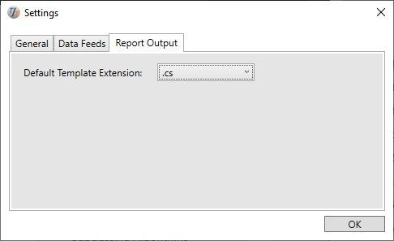

# Demo 01: Calculating Indicators

It is time to start coding and create our first algorithm. In this example, we demonstrate the following techniques: 

* Basic algorithm structure

* Loading data
* Processing bars and accessing instruments
* Accessing time series data
* Plotting data

## Basic Algorithm Structure

The most simple TuringTrader algorithm we can write looks like this: 

```c#
using TuringTrader.Simulator;
using TuringTrader.Indicators;

public class HelloWorld : Algorithm
{
	override public void Run()
	{
		Output.WriteLine("Hello, we're running.");
	}
	
	override public void Report()
	{
		Output.WriteLine("Hello, here is your report.");
	}
}
```

First, we add the [TuringTrader.Simulator](xref:TuringTrader.Simulator) and [TuringTrader.Indicators](xref:TuringTrader.Indicators) namespaces, so that we may access TuringTrader's classes without having to qualify the use of those types. 

Next, we derive a new class from [Algorithm](xref:TuringTrader.Simulator.Algorithm). We make our new class public so that the simulator can discover the available algorithms using reflection. 

The [Run](xref:TuringTrader.Simulator.Algorithm#TuringTrader_Simulator_Algorithm_Run) method is where we implement all of the algorithm's logic: initialization, data-processing, and cleanup. The simulator calls Run only once over the lifetime of an algorithm object.

The [Report](xref:TuringTrader.Simulator.Algorithm#TuringTrader_Simulator_Algorithm_Report) method is where we render a report to present the algorithm's outcome. TuringTrader can create reports in many different ways, based on user-definable templates, allowing you to create any report format you see fit. 

## Loading Data

Now that we have a dummy algorithm, it is time to add some useful functionality to the Run method. The first thing an algorithm needs to do is to load data. We do so in two steps: 

* Specify the simulation range. We do so by setting the [StartTime](xref:TuringTrader.Simulator.SimulatorCore#TuringTrader_Simulator_SimulatorCore_StartTime) and [EndTime](xref:TuringTrader.Simulator.SimulatorCore#TuringTrader_Simulator_SimulatorCore_EndTime) properties.
* Add one or more [DataSource](xref:TuringTrader.Simulator.DataSource) objects to our algorithm. We do so by calling [AddDataSource](xref:TuringTrader.Simulator.SimulatorCore#TuringTrader_Simulator_SimulatorCore_AddDataSource_System_String_), which instantiates the appropriate data source implementation to load the data.

The relevant portion of code looks like this: 

```c#
StartTime = DateTime.Parse("01/01/2015");
EndTime = DateTime.Parse("12/31/2016");
AddDataSource("$SPX");
```

## Processing Bars and Accessing Instruments

We are now ready to start processing data. TuringTrader creates a single event for each simulation time stamp. This model greatly simplifies the development of algorithms working on instrument portfolios, or with options. We request simulation time stamps by looping through the [SimTimes](xref:TuringTrader.Simulator.SimulatorCore#TuringTrader_Simulator_SimulatorCore_SimTimes) enumerable:

```c#
foreach (DateTime simTime in SimTimes)
{
	// process bars here
}
```

Inside this loop, we have access to the [Instruments](xref:TuringTrader.Simulator.SimulatorCore#TuringTrader_Simulator_SimulatorCore_Instruments) property, which holds all known instruments. There are several ways to find the instrument object we are looking for. For a simple algorithm, working on only a single instrument, e.g., a basic stock-trading algorithm, we can use the first element: 

```c#
Instrument instrument = Instruments.First();
```

Most algorithms reference multiple instruments though. In this case, we can look up the instrument via its nickname using [FindInstrument](xref:TuringTrader.Simulator.SimulatorCore#TuringTrader_Simulator_SimulatorCore_FindInstrument_System_String_):

```c#
Instrument instrument = FindInstrument("$SPX");
```

When trading options, there is a one-to-many relationship between a nickname and the instrument it references, which requires a slightly different approach. We'll talk about that when we walk through the [options trading demo](Demo04.md). 

An [Instrument](xref:TuringTrader.Simulator.Instrument) holds, among others, the following invariable information: 

* Nickname: the nickname we used to add the data source.
* Name: the descriptive name of the instrument, e.g., "Alphabet Inc Class A".
* Symbol: the full symbol used to trade this instrument: this may be the ticker, as in "GOOGL", or the ticker plus expiry, right, and strike as in "XSP180919P00284000".
* LastTime: this is the timestamp of the last bar received by this instrument, which is essential to distinguish active from stale instruments.

## Accessing Time Series Data

An [Instrument](xref:TuringTrader.Simulator.Instrument) also holds, among others, the following time series: 

* Open, High, Low, Close, Volume: the market quote data.
* Bid, Ask, BidVolume, AskVolume: the bid/ask quote data.

We can access time series data much like array elements, via the [ITimeSeries< T>](xref:TuringTrader.Simulator.ITimeSeries`1)  interface. The index 0 points to the most current data, index 1 points to the data from the previous bar, and so forth. Typically, we have access to up to 256 bars in the past: 

```c#
double currentClose = instrument.Close[0];
double previousClose = instrument.Close[1];
```

Indicators are calculated on time series data. The result of an indicator is typically also a time series: 

```c#
ITimeSeries<double> ema26Series = instrument.Close.EMA(26);
double ema26Value = ema26Series[0];
```

With the output of indicators being time series, we can calculate indicators on indicators. The following code details the calculation of MACD step by step: 

```c#
ITimeSeries<double> ema26  = instrument.Close.EMA(26);
ITimeSeries<double> ema12  = instrument.Close.EMA(12);
ITimeSeries<double> macd   = ema12.Subtract(ema26);
ITimeSeries<double> signal = macd.EMA(9);
```

TuringTrader includes many 'industry standard' indicators, all of which residing in the [Indicators namespace](xref:TuringTrader.Indicators).

## Plotting Data

Our algorithm now calculates [MACD](xref:TuringTrader.Indicators.IndicatorsTrend#TuringTrader_Indicators_IndicatorsTrend_MACD_TuringTrader_Simulator_ITimeSeries_System_Double__System_Int32_System_Int32_System_Int32_TuringTrader_Simulator_CacheId_System_String_System_Int32_), but it won't share the results with us. TuringTrader can render data natively, save them as CSV, or pass them on to Excel and R. In all cases, we first need to create a [Plotter](xref:TuringTrader.Simulator.Plotter) object: 

```c#
Plotter _plotter = new Plotter();
```

A Plotter object can hold multiple charts. Before we add data, we need to select the working chart, and specify the name of the horizontal axis with [SelectChart](xref:TuringTrader.Simulator.Plotter#TuringTrader_Simulator_Plotter_SelectChart_System_String_System_String_) : 

```c#
_plotter.SelectChart("indicators vs time", "date");
```

Now, for every bar we process, we need to set the value along the horizontal axis with [SetX](xref:TuringTrader.Simulator.Plotter#TuringTrader_Simulator_Plotter_SetX_System_Object_): 

```c#
_plotter.SetX(SimTime[0]);
```

Next, we can add one or more values to the vertical axis with [Plot](xref:TuringTrader.Simulator.Plotter#TuringTrader_Simulator_Plotter_Plot_System_String_System_Object_): 

```c#
_plotter.Plot(instrument.Symbol, instrument.Close[0]);
_plotter.Plot("ema26", ema26[0]);
_plotter.Plot("ema12", ema12[0]);
_plotter.Plot("macd", macd[0]);
_plotter.Plot("signal", signal[0]);
```


At the end of the simulation, we can create a CSV file with a simple call to [SaveAsCsv](xref:TuringTrader.Simulator.Plotter#TuringTrader_Simulator_Plotter_SaveAsCsv_System_String_System_String_System_Func_System_Object_System_String__): 

```c#
_plotter.SaveAsCsv(filePath);
```

As a result, we create a CSV file at the specified location like this, but with many more lines:

```csv
date,^SPX,ema26,ema12,macd,signal
01/02/2015,258.2,258.2,258.2,0,0
01/05/2015,220.58,255.4133,252.4123,-3.0010,-0.6002
```

We typically implement all output functionality in the Report method. That way, no unnecessary output is getting into our way, especially while running the optimizer. 

We like charts much more than tables. Creating a pretty plot requires just a simple call to [OpenWith](xref:TuringTrader.Simulator.Plotter#TuringTrader_Simulator_Plotter_OpenWith_System_String_): 

```c#
_plotter.OpenWith("SimpleChart");
```

The parameter passed into the method refers to a template, which controls the appearance. If the template file name does not include an extension, like in this example, the extension used is the Default Template Extension from the Report Output Settings:



Here is how a simple plot could look like, when using a native C# template:


Please find the full code for this demo in our [repository](https://github.com/fbertram/TuringTrader/blob/master/Algorithms/Demo%20Algorithms/Demo01_Indicators.cs).

There are virtually no limits to the customized reports and plots we can create. The repository contains simple templates, but you are welcome to create your own, fancier and more elegant ones. Read [this topic](CustomTemplates.md) to learn more.

