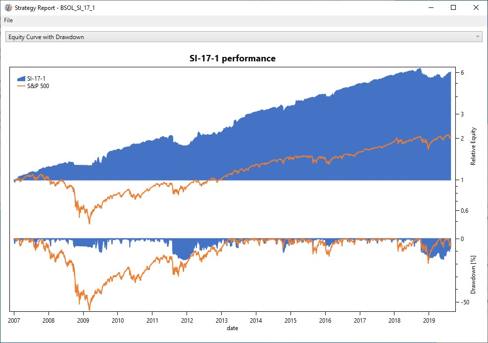
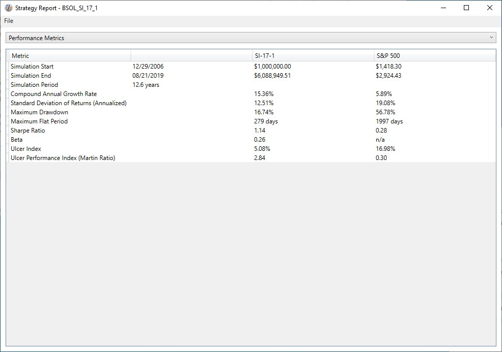
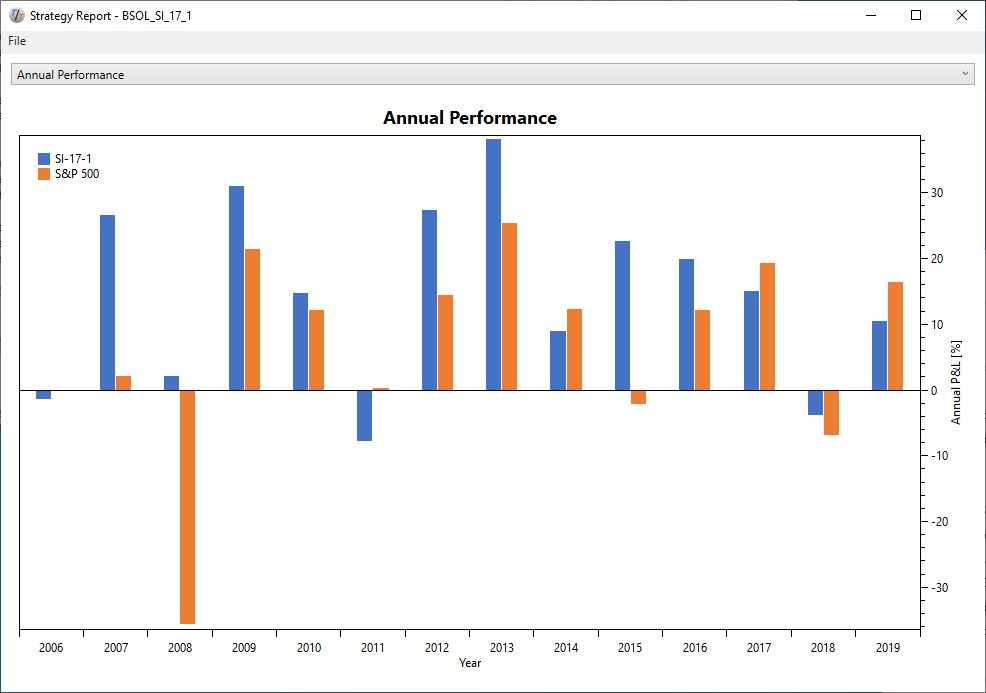
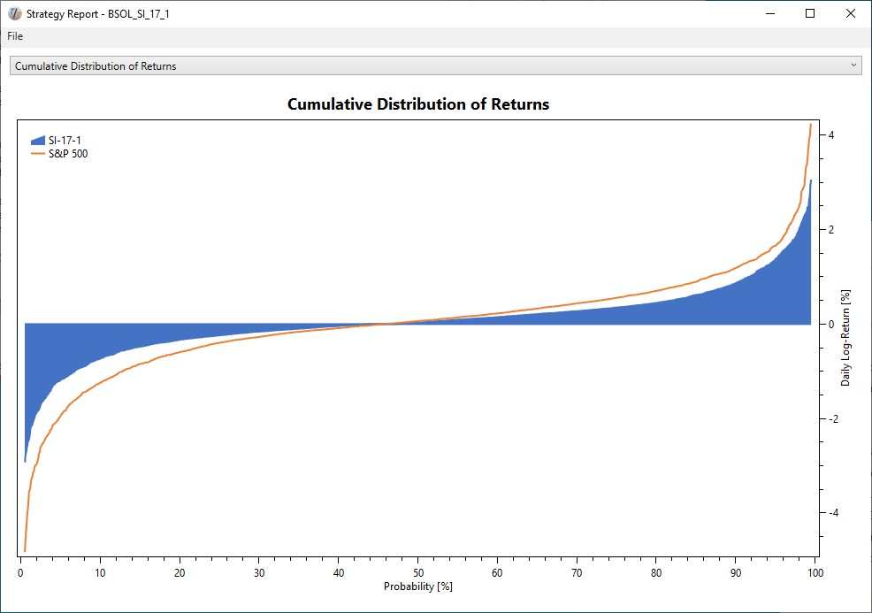
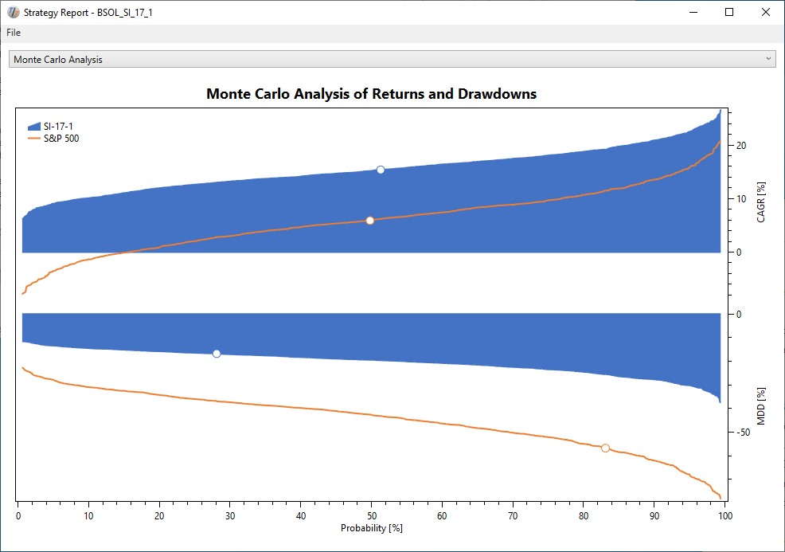
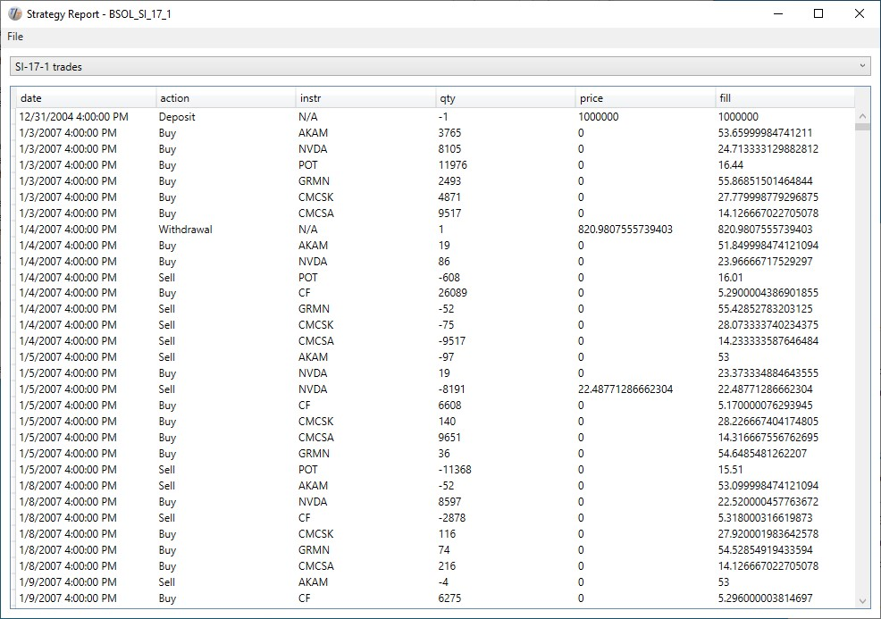

# Using the SimpleReport Template

TuringTrader's reports are based on customizable templates. As the default go-to template, we recommend using the SimpleReport template included with the distribution. In this article, we describe how to use the template and explain how to interpret the charts.

## Creating the Default Views

In [Demo01](Demo01.md), we have seen how to create simple charts with TuringTrader. Using SimpleReport works almost the same way, with only a few specialties to consider.

`SimpleReport` looks at the first chart sent to a given [Plotter](xref:TuringTrader.Simulator.Plotter) object to create all of its default views. This chart must follow a specific format:

* The x-axis must be of `DateTime` format, most likely derived from the simulator's [SimTime](xref:TuringTrader.Simulator.SimulatorCore#TuringTrader_Simulator_SimulatorCore_SimTime).
* The first data column must be the strategy's value, most likely derived from the simulator's [NetAssetValue](xref:TuringTrader.Simulator.SimulatorCore#TuringTrader_Simulator_SimulatorCore_NetAssetValue).
* The second column must be the benchmark to use for the report. For many strategies, this is the S&P 500 Total Return Index.

Here is some example code:

```c#
_plotter.SelectChart("My First Chart", "Date");
_plotter.SetX(SimTime[0]);
_plotter.Plot("SI-17-1", NetAssetValue[0]);
_plotter.Plot("S&P 500", _benchmark.Close[0]);

```

Please note the following:

* The names of the chart and x-axis, "My First Chart" and "Date" in the example, are ignored.
* The names of the data columns, "SI-17-1" and "S&P 500" in the example, show up in the chart legends, and the column header of the metrics table.

## Default Views

From the single chart sent to the Plotter object, `SimpleReport` creates multiple pages, the default views.

### Equity Curve with Drawdown

After running a backtest, the first thing most developers are interested in is the equity curve. That’s why this is the first page we show, just like most other backtesting engines do. The chart provides a quick overview of the strategy’s performance and risk:



The chart has the following characteristics:

* The equity curves for the backtest and the simulation are scaled, such that they both start with a value of one on the leftmost date.
* The equity curves are plotted on a logarithmic scale. Doing so makes it easier to spot irregularities in the strategy's return, and to compare the strategy's performance to the benchmark.
* Below the equity curve, the drawdown is shown as an underwater chart. The drawdown at the leftmost date is always zero, which may be misleading.

### Performance Metrics

After you’ve had your first visual impression of the strategy’s behavior, it is time for cold facts. The performance metrics page shows a selection of commonly used performance metrics:



Please note the following:

* The Standard Deviation of Returns is based on monthly returns and then annualized.
* The Sharpe Ratio is calculated on monthly returns and then annualized. As the risk-free rate, the template uses the [3-Month Treasury Bill Rate](https://fred.stlouisfed.org/series/DTB3).
* Beta is calculated between the strategy and its benchmark.

### Annual Performance

Many investors like to think about their assets in terms of yearly returns. Therefore, we provide a page with annual columns showing the returns:



Some notes:

* The leftmost and rightmost columns are likely to show partial years. The chart does not annualize these but assumes that the returns in these columns are for the whole year.

### Cumulative Distribution of Returns

The next view shows the cumulative distribution of returns. As with all of our views, we show the strategy alongside its benchmark:



For those not familiar with [Cumulative Distribution Functions](https://en.wikipedia.org/wiki/Cumulative_distribution_function), the chart shows the maximum daily return for a given probability. The chart above shows that 90% of the days our strategy has a return of about 1% or less.

What makes this chart especially useful is the comparison of a strategy to its benchmark. Here are some findings from the example above:

- Overall, our strategy above behaves similar to its benchmark but with reduced daily volatility.
- The volatility reduction is stronger towards the downside than it is to the upside. Therefore, the strategy most likely generates a better[ risk-adjusted return](https://en.wikipedia.org/wiki/Sharpe_ratio) than its benchmark.

### Monte Carlo Analysis

[Monte Carlo Analysis](https://en.wikipedia.org/wiki/Monte_Carlo_method) takes a given distribution function, like the one from the previous page, reshuffles the returns in time, and creates a large number of “parallel universes” with their alternative realities. Then, it runs statistics on these alternative results:



This method helps to develop a better idea of how representative a backtest result is, and what we should reasonably expect for out-of-sample performance. The view shows cumulative distribution functions for annual return and maximum drawdowns. The graphs include a marker, showing where the original backtest ranked.

Again, what makes this especially useful is the comparison to the benchmark. Here are some findings from the example chart:

- Overall, our strategy has higher returns and lower drawdowns than the benchmark for any given probability.
- Over the 12.6 years of the simulation, our strategy has positive returns in all parallel universes, while about 18% of universes show negative returns for our benchmark.
- About 83% of the parallel universes show lower maximum drawdowns for our benchmark while the remainder has even worse meltdowns than 2008.
- About 72% of the universes show higher drawdowns for our strategy, which tells us we might want to adjust our expectations accordingly. The chart shows that 80% of the tests resulted in drawdowns of less than 30%.

Monte Carlo analysis is an invaluable tool to have, as it helps to identify statistical flukes and develop more robust strategies.

## Adding Custom Charts and Tables

While the default views are very useful, we are aware that developers of strategies always want more. The `SimpleReport` template allows adding any number of strategy-specific charts or tables to address this need. Doing so works precisely as we showed in the [Demo01](Demo01.md).

Here is a code example to add a page with a list of trades:

```c#
if (IsLastBar)
{
    _plotter.SelectChart(Name + " trades", "date");
    foreach (LogEntry entry in Log)
    {
        _plotter.SetX(entry.BarOfExecution.Time);
        _plotter.Plot("action", entry.Action);
        _plotter.Plot("instr", entry.Symbol);
        _plotter.Plot("qty", entry.OrderTicket.Quantity);
        _plotter.Plot("price", entry.OrderTicket.Price);
        _plotter.Plot("fill", entry.FillPrice);
    }
}
```

This code creates a page like this:

